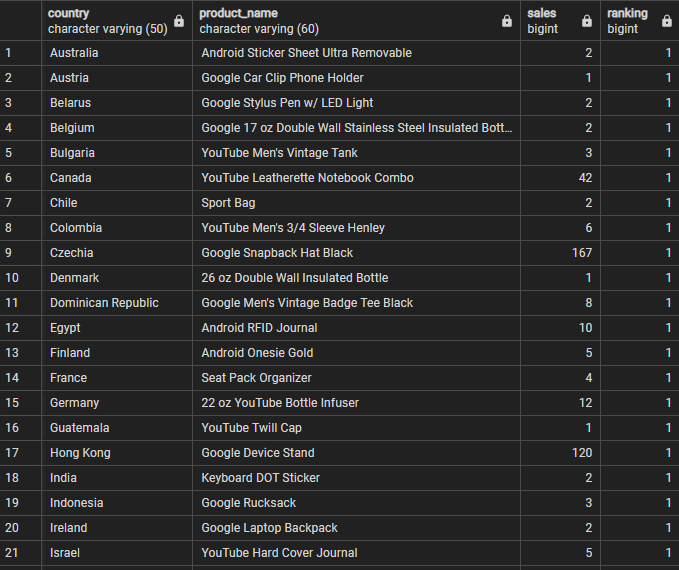

Answer the following questions and provide the SQL queries used to find the answer.

    
**Question 1: Which cities and countries have the highest level of transaction revenues on the site?**


SQL Queries:
``` sql
-- Country only
SELECT all_s.country,
	   ROUND(SUM(units_sold * unit_price)::NUMERIC, 2) AS total_revenue
FROM all_sessions AS all_s
LEFT JOIN analytics
ON all_s.session_id = analytics.session_id
WHERE units_sold IS NOT NULL
GROUP BY all_s.country
ORDER BY total_revenue DESC;

-- City
SELECT all_s.city,
	   all_s.country,
	   ROUND(SUM(units_sold * unit_price)::NUMERIC, 2) AS total_revenue
FROM all_sessions AS all_s
LEFT JOIN analytics
ON all_s.session_id = analytics.session_id
WHERE units_sold IS NOT NULL
	  AND NOT city = 'not available in demo dataset'
GROUP BY all_s.city,
	     all_s.country
ORDER BY total_revenue DESC;
```


Answer:
The country with the highest level of transaction revenue is the United States.

The city with the highest level of transaction revenue is Mountain View, US.


**Question 2: What is the average number of products ordered from visitors in each city and country?**


SQL Queries:
``` sql
-- Country only
SELECT all_s.country,
	   ROUND(AVG(units_sold), 2) AS average_sold
FROM all_sessions AS all_s
LEFT JOIN analytics
ON all_s.session_id = analytics.session_id
WHERE units_sold IS NOT NULL
GROUP BY all_s.country
ORDER BY average_sold DESC;

-- City and Country
SELECT all_s.city,
	   all_s.country,
	   ROUND(AVG(units_sold), 2) AS average_sold
FROM all_sessions AS all_s
LEFT JOIN analytics
ON all_s.session_id = analytics.session_id
WHERE units_sold IS NOT NULL
	  AND NOT city = 'not available in demo dataset'
GROUP BY all_s.city,
	 	 all_s.country
ORDER BY average_sold DESC;
```


Answer:
Countries only:


Cities and Countries:


**Question 3: Is there any pattern in the types (product categories) of products ordered from visitors in each city and country?**


SQL Queries:
``` sql
SELECT all_s.city,
	   all_s.country,
	   all_s.v2_product_category AS product_category,
	   SUM(analytics.units_sold) AS sales
FROM all_sessions AS all_s
LEFT JOIN analytics
ON all_s.session_id = analytics.session_id
WHERE analytics.units_sold IS NOT NULL
	  AND NOT all_s.v2_product_category = '(not set)'
	  AND NOT all_s.city = 'not available in demo dataset'
	  AND NOT all_s.city = '(not set)'
GROUP BY all_s.city, all_s.country, product_category
ORDER BY sales DESC;
```


Answer:
Perusing the results, it seems T-shirts and YouTube purchases are very popular across most countries


**Question 4: What is the top-selling product from each city/country? Can we find any pattern worthy of noting in the products sold?**


SQL Queries:
``` sql
-- Country
WITH ranked_products_country_table AS (
	SELECT all_s.country,
	   	   all_s.v2_product_name AS product_name,
	       SUM(analytics.units_sold) AS sales,
	       RANK() OVER (PARTITION BY all_s.country
						ORDER BY SUM(analytics.units_sold) DESC) AS ranking
	FROM all_sessions AS all_s
	LEFT JOIN analytics
	ON all_s.session_id = analytics.session_id
	WHERE units_sold IS NOT NULL
	GROUP BY all_s.country,
		 	 product_name
)

SELECT *
FROM ranked_products_country_table
WHERE ranking = 1;

-- City
WITH ranked_products_city_table AS (
	SELECT all_s.city,
	   	   all_s.country,
	   	   all_s.v2_product_name AS product_name,
	       SUM(analytics.units_sold) AS sales,
	       RANK() OVER (PARTITION BY all_s.city
						ORDER BY SUM(analytics.units_sold) DESC) AS ranking
	FROM all_sessions AS all_s
	LEFT JOIN analytics
	ON all_s.session_id = analytics.session_id
	WHERE NOT all_s.city = 'not available in demo dataset'
	      AND NOT all_s.city = '(not set)'
	      AND units_sold IS NOT NULL
	GROUP BY all_s.city,
	     	 all_s.country,
		 	 product_name
)

SELECT *
FROM ranked_products_city_table
WHERE ranking = 1;
```

Answer:
I generaly see Google products being the most popular.

Country:



City:


**Question 5: Can we summarize the impact of revenue generated from each city/country?**

SQL Queries:


Answer:


